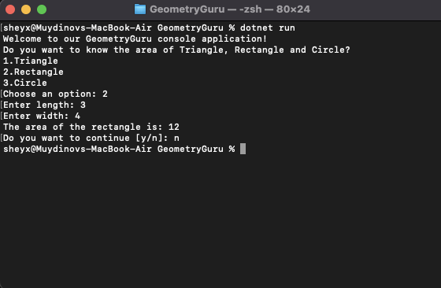

# GeometryGuru
This app helps you to find area in Geometry

# Geometry Guru

## Overview

The Geometry Guru is a console application that empowers users to effortlessly calculate the area of various geometric shapes, including triangles, rectangles, and circles. With interactive prompts, users can choose the shape they want to work with and input the required parameters to calculate the area.

## Features

- Calculate the area of triangles, rectangles, and circles.
- User-friendly interface with easy-to-follow prompts.
- Clear instructions and examples to assist users.

## How to Use

1. **Clone the Project**: Clone this project repository to your local machine:

   ```shell
   git clone https://github.com/yourusername/geometry-guru.git

1. Navigate to the Project Directory:

    ```shell
    cd GeometryGuru
2. Compile and Run the Program:
    ```shell
    dotnet run

3. Choose the Geometry Shape:

    The program will display a menu with options to choose the geometry shape you want to work with.
    Enter the corresponding option number (e.g., 1 for Triangle, 2 for Rectangle, 3 for Circle).

4. Follow On-Screen Prompts:

    Based on your selection, the program will prompt you for the required parameters.
    Input the values as instructed (e.g., base and height for a triangle, length and width for a rectangle, or radius for a circle).
5. View the Result:

    The program will calculate and display the area of the selected geometric shape based on your inputs.
6. Exit the Program:

    Follow the on-screen instructions to exit the program when you're done.

## Example


